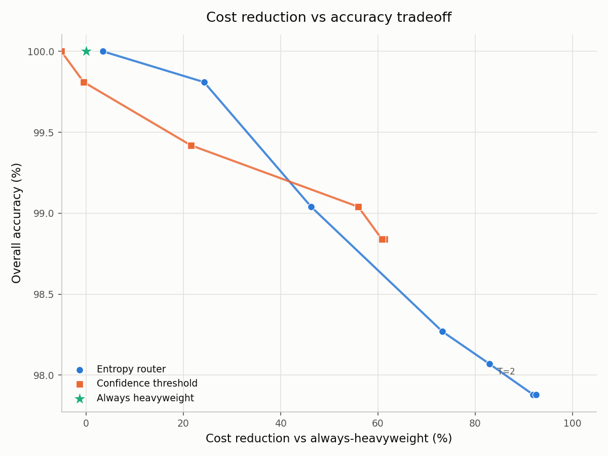

# Results: Entropy Router vs. Baselines

This document evaluates the entropy-based router against two baselines on the
project's 520-prompt benchmark set: a naive top-1 confidence threshold, and an
always-heavyweight ceiling. All numbers below come from actually running the
tooling in `benchmarks/` against a real, freshly collected dataset — none are
estimated or reused from earlier documentation without being re-verified.

**Headline finding:** the entropy router reaches cost-reduction levels the
naive confidence-threshold baseline cannot reach at all, but not because its
per-token confidence signal is inherently better at moderate operating
points — in that regime the two are comparable, and the confidence baseline
is briefly *ahead*. The real advantage is robustness to a logprob-reporting
artifact in the OpenAI API that permanently cripples the naive single-token
signal. Details below, including a discrepancy with the previously published
91.6% cost-reduction figure that we could not reproduce.

---

## 1. Dataset

520 prompts across 4 categories (`benchmarks/testdata/prompts.json`):

| Category | Count |
|---|---|
| `simple_factual` | 150 |
| `multi_step_reasoning` | 150 |
| `code_generation` | 110 |
| `ambiguous_creative` | 110 |

One prompt (`multi_step_reasoning_087`) failed collection with a transient
SSE read timeout and was excluded, leaving **519 valid records**.

**Judge methodology:** for every prompt, the drafter (gpt-4.1-nano) and
heavyweight (gpt-4.1) models each generate a response. An LLM judge (gpt-4.1,
`benchmarks/internal/collect/judge.go`) scores the draft against the
heavyweight response as reference on a 1-5 scale; score ≥ 3 is
`acceptable=true`. This acceptability label is fixed per record — it does not
change with the routing threshold. Only 11/519 drafts (2.1%) were ever judged
unacceptable; keep that class imbalance in mind when reading precision/recall
below.

## 2. New instrumentation: why this required a fresh collection

The original `collected.jsonl` stored only the derived Shannon entropy per
token, not the raw logprob it was computed from — entropy is a lossy
aggregate over the top-k candidate distribution, so a single token's top-1
logprob isn't recoverable from it after the fact. Implementing the
confidence-threshold baseline required capturing that raw value, so:

- `internal/entropy/entropy.go` and `benchmarks/internal/collect/{record,collector}.go`
  were extended to also persist each token's `logprob` (the OpenAI-reported
  logprob of the actually-sampled token) alongside its entropy.
- The full 520-prompt dataset was re-collected against the real OpenAI API
  (drafter + heavyweight reference + judge, ~$2.94 estimated cost, approved
  before running) so entropy routing, confidence-threshold routing, and
  always-heavyweight are all evaluated against the *same* frozen draft
  samples and judge verdicts — a fair, internally consistent comparison.
- The prior dataset is preserved at `benchmarks/results/collected.pre_logprob.jsonl.bak`.

## 3. Methodology

All three methods are implemented as `sweep.EscalationPolicy` functions
(`benchmarks/internal/sweep/policy.go`) replayed against the same recorded
token traces — no new API calls happen during sweeping.

**Entropy router** (production algorithm, `sweep.EntropyPolicy`): sliding
window of size 10 over per-token Shannon entropy (computed from the top-5
logprobs OpenAI returns). Escalates if the windowed average exceeds
threshold `T`, with an early-exit check on the first 10 tokens. Swept at
`T ∈ {1.00, 1.25, 1.50, 1.75, 2.00, 2.25, 2.50}`, matching the range in
`docs/METRICS.md`.

**Confidence threshold** (`sweep.ConfidencePolicy`): no entropy, no window,
no early exit. Generates the full drafter response, takes the single lowest
per-token logprob across it, and escalates if that minimum is below
threshold. Swept at seventeen thresholds from `-0.01` to `-40.0`.

**Always heavyweight** (`sweep.AlwaysHeavyweightPolicy`): every request goes
straight to gpt-4.1. This never calls the drafter, so its cost is exactly
the heavyweight-only baseline cost by construction — cost reduction is 0%
by definition, not something measured with variance. Its "100% accuracy" in
the table below is a **definitional artifact**: the heavyweight response is
the judge's reference answer, so it cannot be judged against itself as
unacceptable. It is a cost/accuracy ceiling, not evidence gpt-4.1 is
independently 100% correct.

**Cost model** (`benchmarks/internal/sweep/cost.go`, unchanged from the
existing sweep tool): $0.20 / $0.80 per 1M drafter input/output tokens,
$2.50 / $10.00 per 1M heavyweight input/output tokens. Entropy and
confidence routing both pay the drafter's cost on every request (they need
its output to make the decision); always-heavyweight does not.

**Overall accuracy** (new metric, alongside the existing `draft_accuracy`
from METRICS.md): fraction of *all* served responses judged acceptable,
`1 - FN/total`. `draft_accuracy` (`TN/(TN+FN)`) only looks at the
non-escalated subset and can look artificially strong at aggressive
thresholds where almost nothing is accepted; `overall_accuracy` is what
matters for the cost/accuracy tradeoff plot below.

## 4. Results

Full sweep: [`benchmarks/results/compare.csv`](../benchmarks/results/compare.csv). Condensed:

| Method | Threshold | Escalation Rate | Overall Accuracy | Cost Reduction |
|---|---|---|---|---|
| entropy_router | 1.00 | 68.0% | 100.0% | 3.5% |
| entropy_router | 1.25 | 48.6% | 99.8% | 24.3% |
| entropy_router | 1.50 | 32.6% | 99.0% | 46.3% |
| entropy_router | 1.75 | 15.6% | 98.3% | 73.3% |
| **entropy_router** | **2.00** | **7.7%** | **98.1%** | **82.9%** |
| entropy_router | 2.25 | 0.8% | 97.9% | 91.9% |
| entropy_router | 2.50 | 0.0% | 97.9% | 92.6% |
| confidence_threshold | -0.01 | 92.9% | 100.0% | -7.1% |
| confidence_threshold | -1.00 | 80.2% | 100.0% | -5.8% |
| confidence_threshold | -3.00 | 69.4% | 99.8% | -0.5% |
| confidence_threshold | -5.00 | 47.0% | 99.4% | 21.5% |
| confidence_threshold | -8.00 | 22.4% | 99.0% | 56.0% |
| confidence_threshold | -10.00 | 19.3% | 98.8% | 60.8% |
| **confidence_threshold** | **-15.00 and beyond** | **18.7%** | **98.8%** | **61.5% (hard ceiling)** |
| always_heavyweight | n/a | 100.0% | 100.0%¹ | 0.0% |

¹ Definitional, see §3.

Cost-reduction vs. accuracy tradeoff:



## 5. Discussion — where entropy wins, where it doesn't

**In the conservative-to-moderate regime, the two methods are genuinely
comparable, and confidence-threshold is briefly ahead.** At matched overall
accuracy of 99.04%, entropy routing (`T=1.50`) achieves 46.3% cost
reduction; confidence-threshold (`threshold=-8.00`) achieves 56.0% —
*higher* cost reduction at the same accuracy. If your target operating
point is in this range, the extra complexity of windowed entropy and
early-exit isn't obviously earning its keep over a single logprob check.

**Past ~60% cost reduction, confidence-threshold cannot follow — at any
threshold.** Its curve hits a hard ceiling at 61.5% cost reduction /
18.7% escalation rate that does not move between `threshold=-15` and
`threshold=-40`. Entropy routing keeps climbing to 82.9% (T=2.00) and 92.6%
(T=2.50).

**The reason for the ceiling is a real, diagnosable artifact, not
noise.** 97/519 records (18.7%) contain at least one token where the OpenAI
API reports `logprob: -9999.0` for the actually-sampled token — a known API
quirk that occurs when the sampled token falls outside the requested
top-N logprob candidates. This sentinel poisons the confidence-threshold
signal: once a response contains one, its minimum logprob is -9999
regardless of how lenient the threshold gets, so it always escalates. It is
heavily concentrated by category:

| Category | Records with the artifact |
|---|---|
| `simple_factual` | 0 / 150 (0.0%) |
| `code_generation` | 6 / 110 (5.5%) |
| `multi_step_reasoning` | 19 / 149 (12.8%) |
| `ambiguous_creative` | 72 / 110 (65.5%) |

This tracks with lexical diversity — open-ended creative generation is far
more likely to sample a token outside the top-5 candidates than a
deterministic factual answer. The entropy router is unaffected by this
specific artifact because its signal is computed from the returned top-k
*alternatives* distribution, not from the sampled token's own reported
logprob — a single corrupted field doesn't dominate a windowed average the
way it dominates a single min() over the whole response. This is the real,
defensible advantage of entropy routing over the naive baseline: not signal
quality at a given operating point, but robustness that lets it scale into
a cost-savings regime the simpler method structurally cannot reach.

**Class imbalance makes precision/recall/F1 look weak for every method,
including entropy routing at its documented threshold.** Only 11/519 drafts
were ever judged unacceptable, so the positive class for the confusion
matrix is tiny; F1 tops out around 0.10 for entropy_router even at
T=2.00. This is a property of the dataset (the drafter is good, bad drafts
are rare) and applies equally to all three methods — it is not evidence any
method is failing, but it does mean F1 alone is a poor way to compare them
here. Escalation rate, overall accuracy, and cost reduction are the more
informative axes, which is why the table and plot lead with those.

**The previously published 91.6% cost-reduction headline (`docs/METRICS.md`,
T=2.0) did not replicate in this independent re-collection.** The new
estimate at the same threshold is 82.9%, with a 95% bootstrap CI of
[79.6%, 86.0%] — the old figure falls outside that interval. Escalation rate
at T=2.0 only moved from 6.0% to 7.7% between the two runs, but cost
reduction dropped by nearly 9 points; the likely explanation is that the
~40-record escalated set is small enough that its aggregate cost is
sensitive to exactly which prompts land in it (heavyweight response length
varies a lot request to request, and both drafter and judge sampling are
non-deterministic across independent collection runs). This is precisely
the failure mode a bootstrap CI is meant to catch — a bare point estimate on
~500 prompts is not a stable number, and the original 91.6% should be
treated as an optimistic draw rather than a reproducible constant. We are
not updating `docs/METRICS.md` here since that's a judgment call for you to
make; flagging it is the scope of this document.

## 6. Bootstrap confidence intervals

2000 resamples, seed 42 (`sweep.Bootstrap`, `benchmarks/internal/sweep/bootstrap.go`):

| Method | Threshold | Cost Reduction (95% CI) | Overall Accuracy (95% CI) |
|---|---|---|---|
| entropy_router | T=2.00 | 82.9% [79.6%, 86.0%] | 98.1% [96.7%, 99.0%] |
| confidence_threshold | threshold=-15.00 (matched cost reduction, capped) | 61.5% [56.3%, 66.8%] | 98.8% [97.9%, 99.6%] |

The confidence-threshold interval is the closest the method can get to
entropy's cost reduction — its own ceiling — not a matched point, since it
cannot reach 82.9% at any threshold (§5).

## 7. Reproducing this

```bash
# Full recollection (real API cost, ~$2.94 for 520 prompts at current pricing)
OPENAI_API_KEY=... go run ./benchmarks/cmd/collect -output benchmarks/results/collected.jsonl

# Three-method comparison sweep + bootstrap CI, no API calls (replays recorded traces)
go run ./benchmarks/cmd/compare -output benchmarks/results/compare.csv

# Plot
python benchmarks/plot_tradeoff.py
```

## 8. What would strengthen this further

- **Category-stratified sweep.** The artifact in §5 is category-correlated;
  a per-category breakdown of the tradeoff curve (not just the aggregate)
  would show whether entropy's advantage is concentrated in
  `ambiguous_creative` or holds broadly. Not done here for scope.
- **A second independent collection run** to see whether 82.9% at T=2.0
  replicates, given it already moved once. The bootstrap CI models sampling
  uncertainty *within* one collected dataset, not the added variance from
  redrawing the underlying draft/judge samples themselves.
- **A confidence-threshold variant with sentinel-value handling** (e.g.
  falling back to entropy or skipping the token when logprob is a
  known-sentinel) would isolate whether the entropy router's edge really is
  robustness to this artifact, as claimed, versus something else. Left as
  the literal, unmodified simplest baseline per the original request.
